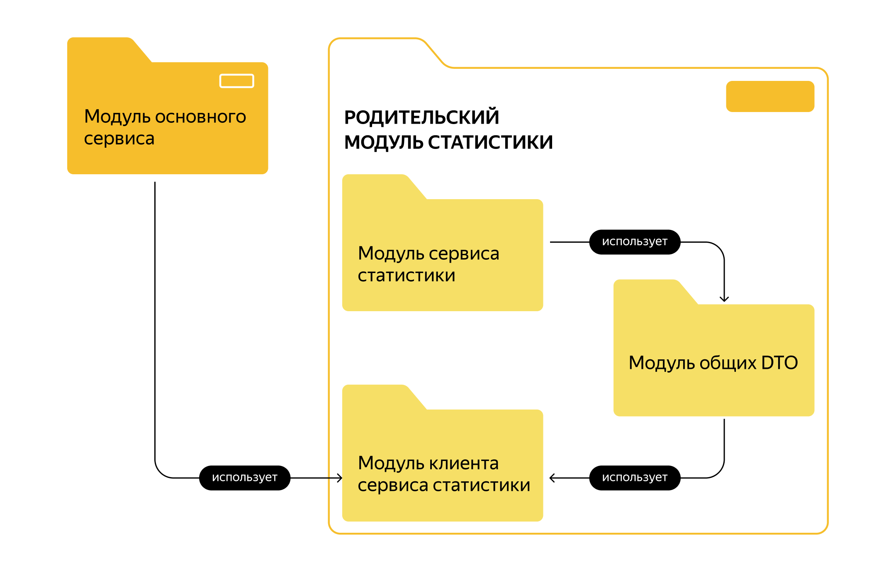

# Explore With Me

Explore With Me это микросервисное приложение - афиша. В нём можно предложить любое событие от концерта до похода в музей и собрать компанию для участия в нём.

Свободное время - это ценность. Это приложение помогает сократить время на поиск интересных событий, учитывая все возможные мероприятия и расписание друзей.
Теперь будет легко выбрать интересное событие, место встречи и пригласить всех желающих.

Приложение строится на двух сервисах:
- Main сервис содержит всё необходимое для работы продукта;
- Сервис статистики хранит количество просмотров и позволяет делать различные выборки для анализа работы приложения.

API основного сервиса в свою очередь делится на три части:
- публичная доступна без регистрации любому пользователю сети;
- закрытая доступна только авторизованным пользователям;
- административная — для администраторов сервиса.

Применяемы технологии:
- Java 11
- Spring Boot
- Docker
- Hibernate
- PostgreSQL
- Maven
- Lombok
- Junit5
- Postman
- REST

#### Схема базы данных:

